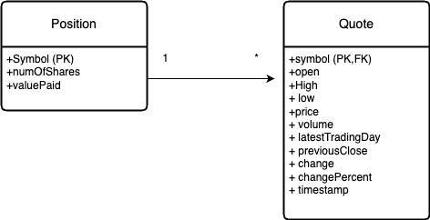

# Introduction
This application is a stock quote management system that allows users to buy and sell stocks, view their portfolio, and fetch and store real-time stock quote data. The application is built using Java and utilizes JDBC for database connectivity, PostgreSQL for the database management system, Maven for project management, and Mockito for unit and integration testing.

# Implementation
## ER Diagram

## Design Patterns
The project follows the DAO (Data Access Object) and Repository design patterns.
- **DAO Pattern**: It abstracts and encapsulates all access to the data source. DAO classes (`PositionDao` and `QuoteDao`) handle the CRUD operations for the corresponding model entities (`Position` and `Quote`).
- **Repository Pattern**: It provides a more high-level abstraction over the data access layer. The `CrudDao` interface acts as a repository providing standard CRUD operations which are then implemented by the DAO classes.

### Class Files
1. **Position.java**: Model class representing a position with attributes such as ticker symbol, number of shares, and value paid.
2. **PositionDao.java**: DAO class implementing CRUD operations for the `Position` entity.
3. **Quote.java**: Model class representing a stock quote with attributes like open, high, low, price, etc.
4. **QuoteDao.java**: DAO class implementing CRUD operations for the `Quote` entity.
5. **DatabaseConnectionManager.java**: Manages the database connection.
6. **QuoteHttpHelper.java**: Helper class for fetching quote data from an API.
7. **PositionService.java**: Service class for handling business logic related to positions.
8. **QuoteService.java**: Service class for handling business logic related to quotes.
9. **StockQuoteController.java**: API controller class for interacting with users and handling user requests.
10. **Main.java**: Main class for initializing and running the application.

### DDL (Data Definition Language)
- `position` table:
```
CREATE TABLE position (
  symbol VARCHAR PRIMARY KEY,
  number_of_shares INT NOT NULL,
  value_paid DOUBLE PRECISION NOT NULL
);
```
- `quote` table:
```
CREATE TABLE quote (
  symbol VARCHAR PRIMARY KEY,
  open DOUBLE PRECISION,
  high DOUBLE PRECISION,
  low DOUBLE PRECISION,
  price DOUBLE PRECISION,
  volume INT,
  latest_trading_day DATE,
  previous_close DOUBLE PRECISION,
  change DOUBLE PRECISION,
  change_percent VARCHAR,
  timestamp TIMESTAMP
);
```

## Running the Application
The application can be run using either a JAR file or Docker container.
- **Using JAR File**: Build the project using Maven (`mvn clean package`) and then run the generated JAR file with the appropriate command (`java -jar <jar_file_name>`).
- **Using Docker Container**: Dockerize the application by creating a Dockerfile, build the Docker image, and then run the container with the necessary configurations.

# Test
To test the application against the database, the following steps are taken:
1. **Database Setup**: Ensure that the PostgreSQL database is properly set up and running.
2. **Test Data Setup**: Prepare test data including quotes and positions in the database.
3. **Query Result Verification**: Execute CRUD operations using the application and verify the results against the expected outcomes. This includes checking if data is properly inserted, updated, retrieved, and deleted from the database.
4. **Unit and Integration Tests**: Mockito is used for both unit and integration testing of the application. It helps in mocking dependencies and simulating behavior, making it easier to test individual components and interactions between different layers of the application. Unit tests focus on testing individual methods and classes in isolation, while integration tests ensure that different components work together as expected.